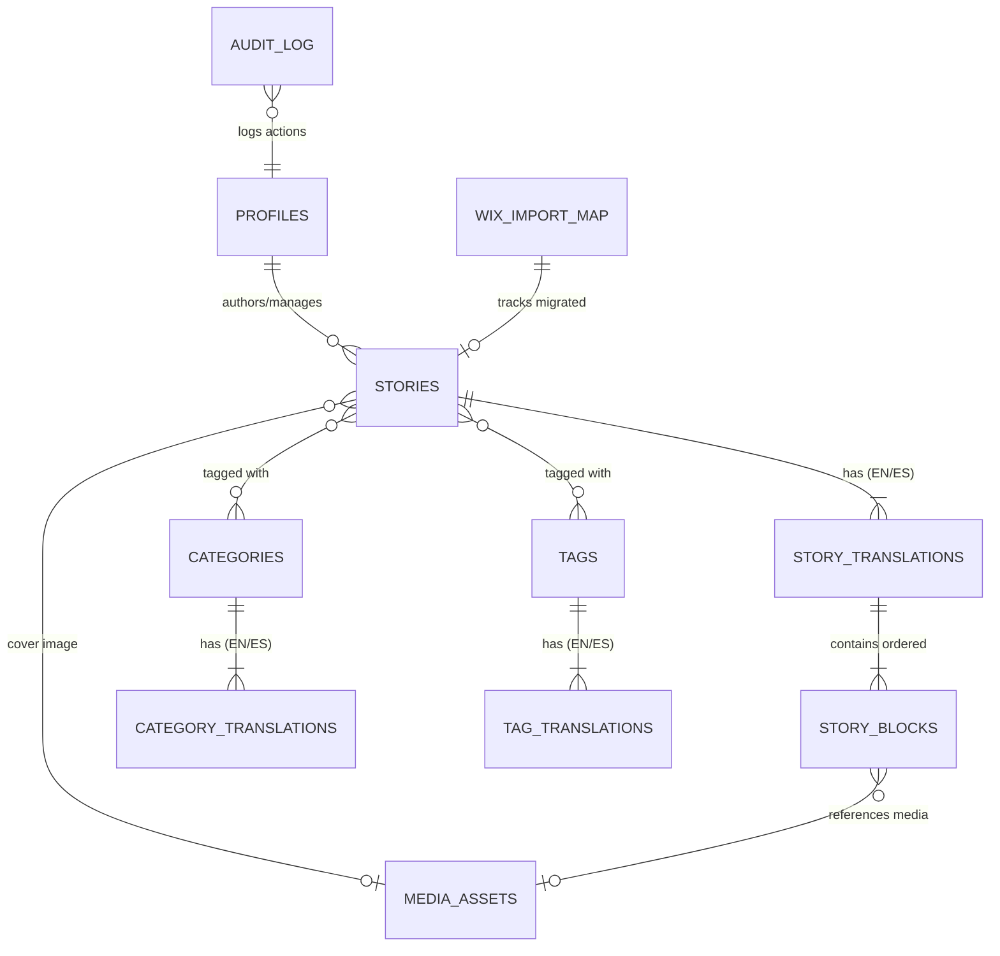

# Dove Youth Development — CMS & Backend Architecture (Phase 1)

This document details the backend foundation, database schemas, Row Level Security (RLS) matrix, content block registry, authentication/authorization flows, media pipeline, and Wix Blog migration system for Dove Youth Development.

---

## 1. Architectural Principles

1. **Brand Integrity vs. Editorial Freedom**: The CMS allows editors control over *what* content is published, the *order* of sections, and structural layouts (e.g., media left/right, standard vs. full width), but strictly forbids arbitrary HTML/CSS, font tampering, or unapproved styling.
2. **Multi-Client Isolation**: Dove data is strictly isolated in its own dedicated Supabase project and Cloudinary namespace (`dove-youth-development/`). No credentials or databases are shared with other client projects.
3. **Multilingual Architecture**: English (`en`) and Spanish (`es`) content are isolated into independent translation records. No AI translations are auto-published without explicit human editorial review.
4. **Defense-in-Depth Security**: Public anonymous access can only read verified, published content where `published_at <= now()`. Authorization is enforced at the database level via Postgres RLS, not just in React components.
5. **Idempotent Migration**: The Wix Blog importer uses the official Wix API, converts rich content into typed block structures, preserves original Wix IDs in an import map, and never duplicates content when rerun.

---

## 2. Database Schema & Supabase Migrations

Migration file: `supabase/migrations/20260917000000_dove_cms_init.sql`

### Core Entity Relationship Diagram



### Table Definitions

1. **`profiles`**: Staff accounts linked to `auth.users(id)`.
   - `role`: `'admin'` (full permissions, user management) or `'editor'` (content creation, drafts, publishing).
   - `active`: boolean flag to disable revoked staff instantly.
2. **`stories`**: Canonical story entity.
   - Status: `'draft'`, `'published'`, or `'archived'`.
   - Flags: `featured_home`, `featured_stories`.
   - Timestamps: `published_at`, `scheduled_at`.
   - Legacy: `legacy_wix_id`, `legacy_wix_url`, `legacy_wix_slug`.
   - Soft-delete: `archived_at` (avoids destructive deletion).
3. **`story_translations`**: Localized content for `en` and `es`.
   - Unique constraints on `(story_id, locale)` and `(locale, slug)`.
   - Fields: `title`, `slug`, `excerpt`, `seo_title`, `seo_description`, `publication_status`.
4. **`story_blocks`**: Ordered content blocks attached to a translation.
   - `block_type`: One of 12 supported block types.
   - `sort_order`: Sequential integer for deterministic rendering.
   - `data`: JSONB payload conforming to the block's schema.
   - `settings`: JSONB presentation options (controlled enums only).
   - `visible`: Toggle visibility without deleting.
5. **`categories` & `category_translations`**: Reusable hierarchical categories with independent EN/ES naming.
6. **`tags` & `tag_translations`**: Reusable article tags.
7. **`media_assets`**: Registry of media assets from both legacy Wix (`provider = 'wix'`) and Cloudinary (`provider = 'cloudinary'`).
   - Tracks dimensions, mime type, file size, original filename, and responsive focal points (`focal_x`, `focal_y`).
8. **`redirects`**: 301/308 redirect mapping to preserve legacy Wix URLs and SEO authority.
9. **`wix_import_map`**: Maps Wix entity IDs (`wix_id`) to internal UUIDs (`local_id`) ensuring idempotent migration runs.
10. **`audit_log`**: Traceability for editorial mutations (create, update, publish, archive).
11. **`migration_runs`**: Logs for dry-run and live migration executions.

---

## 3. Row Level Security (RLS) Policy Matrix

| Table | Anonymous / Public | Authenticated Editor | Authenticated Admin |
|---|---|---|---|
| `profiles` | None | Read own profile | Read all, Insert, Update |
| `stories` | SELECT published (`published_at <= now()`) | SELECT all, INSERT, UPDATE | SELECT, INSERT, UPDATE, DELETE |
| `story_translations` | SELECT published translations of published stories | SELECT all, INSERT, UPDATE | SELECT, INSERT, UPDATE, DELETE |
| `story_blocks` | SELECT visible blocks of published translations of published stories | SELECT all, INSERT, UPDATE, DELETE | SELECT, INSERT, UPDATE, DELETE |
| `media_assets` | SELECT media linked to published stories or published blocks | SELECT all, INSERT, UPDATE | SELECT, INSERT, UPDATE, DELETE |
| `categories` / `tags` | SELECT all public categories & tags | SELECT, INSERT, UPDATE | Full Access |
| `redirects` | SELECT active (`active = true`) | Full Access | Full Access |
| `wix_import_map` | None | SELECT, INSERT, UPDATE | Full Access |
| `audit_log` | None | SELECT, INSERT | Full Access |
| `migration_runs` | None | SELECT, INSERT, UPDATE | Full Access |

---

## 4. Structured Content Block System

Location: `src/lib/cms/blocks/schema.ts`

### Supported Block Types

| Block Type | Primary Data Fields | Validation Constraints |
|---|---|---|
| `heading` | `text`, `level` (2, 3, 4) | Level must be 2, 3, or 4. Text trimmed. |
| `rich_text` | `html` | HTML sanitized against strict allowlist. No `<script>`, `<iframe>`, `on*` handlers. |
| `image` | `url`, `alt`, `caption`, `focalX`, `focalY`, `mediaAssetId` | URL must be HTTPS or valid route. Alt text required. |
| `image_text_split` | `text`, `url`, `alt`, `caption`, `mediaPosition` (`left` \| `right`) | Text sanitized, media position strictly `'left'` or `'right'`. |
| `gallery` | `items` (array of `url`, `alt`, `caption`), `columns` (2, 3, 4) | Non-empty array of valid image items. |
| `quote` | `quote`, `author`, `role`, `source` | Non-empty quote text. |
| `youtube` | `videoId`, `title`, `caption`, `startTime` | Validated YouTube video ID format. No raw iframe HTML. |
| `callout` | `title`, `text`, `tone` (`info` \| `warning` \| `inspiration`) | Text sanitized, tone enum controlled. |
| `button_group` | `buttons` (array of `label`, `href`, `variant`) | HTTPS or internal route only. No `javascript:` or `data:`. |
| `section_intro`| `eyebrow`, `title`, `leadText` | Title required. |
| `divider` | `style` (`line` \| `dots` \| `blank`) | Controlled enum. |
| `spacer` | `height` (`small` \| `medium` \| `large`) | Controlled enum. |

### Controlled Presentation Settings

Editors can choose structural presentation settings from strict enums:
- `width`: `'narrow'` | `'content'` | `'wide'` | `'full'`
- `alignment`: `'left'` | `'center'` | `'right'`
- `mediaPosition`: `'left'` | `'right'` | `'top'` | `'bottom'` | `'full'`
- `theme`: `'default'` | `'warm'` | `'teal'` | `'dark'` | `'accent'`
- `spacing`: `'compact'` | `'normal'` | `'generous'`
- `imageFit`: `'cover'` | `'contain'`

### How to Add a New Block Type

1. In `supabase/migrations/`: Add the new block type name to the `block_type` CHECK constraint on `story_blocks`.
2. In `src/lib/supabase/database.types.ts`: Add the new type name to the `BlockType` union.
3. In `src/lib/cms/blocks/schema.ts`:
   - Define the TypeScript data interface (e.g., `NewBlockData`).
   - Add to `BlockDataMap`.
   - Add a validation branch to `validateBlockData()` verifying fields, types, and sanitization.
4. In `tests/cms-blocks.test.ts`: Add automated tests verifying valid payloads and rejection of malformed data.
5. In Phase 2: Add the corresponding React renderer component in `src/components/cms/blocks/` and the editor control widget.

---

## 5. Media Pipeline & Cloudinary Upload Security

Location: `src/lib/cms/media.ts`

- **Namespace Isolation**: Cloudinary uploads are namespaced under `dove-youth-development/`.
- **Approved Subfolders**: `stories/`, `news/`, `covers/`, `uploads/`, `archive/`, `partners/`.
- **Secure Server-Signed Upload**: Direct uploads from browser to Cloudinary use a cryptographic signature generated server-side by `generateCloudinaryUploadSignature()`. The `CLOUDINARY_API_SECRET` is never sent to the browser.
- **Legacy Media**: Wix CDN images (`static.wixstatic.com`) are preserved in `media_assets` with `provider = 'wix'` and can be migrated on-demand without bulk downloading.

---

## 6. Wix Blog Migration Adapter

Location: `scripts/migrate-wix-blog.ts`

### Commands
- **Dry Run (Fixture)**: `npm run migrate:wix:dry-run`
- **Dry Run (Live Wix API)**: `npm run migrate:wix:live:dry-run`

### Migration Workflow

```
1. Fetch Wix Blog Posts (Live API v3 or Test Fixture)
   ↓
2. Check `wix_import_map` for existing `legacy_wix_id` (Idempotency)
   ↓
3. Transform Wix RichContent AST into Dove Structured Blocks
   (HEADING, PARAGRAPH, IMAGE, GALLERY, VIDEO -> Dove Blocks)
   ↓
4. Extract & Preserve Taxonomy (Categories, Tags, Authors)
   ↓
5. Register Legacy URLs & Generate 301 Redirect Mappings
   (/post/<slug> -> /en/stories/<clean-slug>)
   ↓
6. Generate Comprehensive Audit Report (Dry Run Mode)
   (Reports post count, node types, media, warnings, unsupported content)
```

---

## 7. Public Data Services Layer

Location: `src/lib/cms/public-stories.ts`

- `getStories({ locale, limit, offset, categorySlug })`: Paginated public stories.
- `getStoryBySlug({ locale, slug })`: Full article detail with ordered content blocks.
- `getFeaturedStories(locale, target, limit)`: Featured articles for Home or Stories index.
- `searchStories({ locale, query, limit })`: Keyword/trigram search across titles and excerpts.

All public queries enforce:
`status = 'published' AND published_at <= now() AND translations.publication_status = 'published'`

---

## 8. Verification & Test Suite

Run all CMS tests:
```bash
npm run test:cms
```

Covers:
- Block schema validation (12 block types)
- XSS and malicious HTML sanitization
- Safe URL and protocol enforcement
- Controlled presentation settings enums
- Slug generation and collision detection
- Story, translation, and redirect validation
- Wix AST transformation and non-YouTube fallbacks
- Full dry-run execution on representative fixtures
